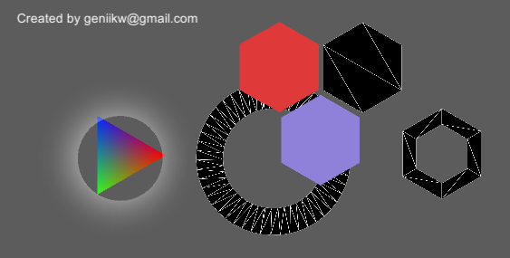

# Draw mesh lines in UI Canvas
Draw bezierCurve lines in Unity3d UI Canvas.

- site(korean) : http://mypi.ruliweb.com/mypi.htm?nid=647825
- email : geniikw@gmail.com

- 3d version : https://github.com/geniikw/3DBezierMeshLine
